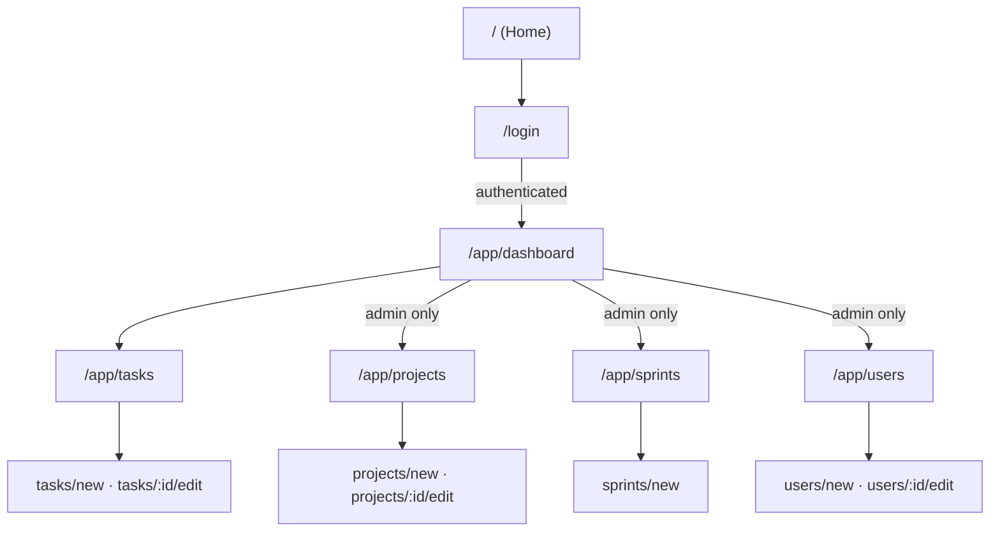

# Trazo

**Plan. Organize. Deliver.**

Trazo is a project and task management web application, built with **Vue 3** as an MVP for the Software Engineering for Web Applications course. Data persistence is handled via **LocalStorage** in the browser, with no backend required for this first delivery.

More project context (verbal model, class diagram, architecture diagram, programming rules) is documented in the [repository Wiki](https://github.com/TomasPosada0626/Trazo/wiki).

## Technologies used

- [Vue 3](https://vuejs.org/) (Composition API, `<script setup>`)
- [TypeScript](https://www.typescriptlang.org/)
- [Vite](https://vite.dev/)
- [Vue Router](https://router.vuejs.org/)
- [Pinia](https://pinia.vuejs.org/)
- [Tailwind CSS v4](https://tailwindcss.com/) (theme tokens declared in `src/assets/css/input.css`)
- [ESLint](https://eslint.org/) + [Prettier](https://prettier.io/)
- [Chart.js](https://www.chartjs.org/) — dashboard charts
- [CountUp.js](https://inorganik.github.io/countUp.js/) — animated dashboard counters

## Prerequisites

- [Node.js](https://nodejs.org/) version 22.18 or higher (or 24.12+)
- npm

## Installation

```sh
npm install
```

## Running in development mode

```sh
npm run dev
```

This starts the development server (by default at `http://localhost:5173`). The public routes are `/` (**Home**) and `/login`; everything else lives under `/app` and requires an active session.

State is seeded into LocalStorage on first load under the `piniaState` key. The preloaded accounts are:

| Email             | Password    | Role          |
| ----------------- | ----------- | ------------- |
| `admin@trazo.com` | `admin123`  | Administrator |
| `juan@trazo.com`  | `admin123`  | Administrator |
| `maria@trazo.com` | `member123` | Member        |

To reset the data, clear the `piniaState` key from LocalStorage and reload.

## Building for production

```sh
npm run build
```

The generated files are placed in the `dist/` folder.

## Previewing the production build

```sh
npm run preview
```

## Linting and formatting

```sh
npm run lint
npm run format
```

Before every `push`, `npm run lint` and `npm run format` must run without errors (see the [Programming Style Guide](https://github.com/TomasPosada0626/Trazo/wiki/Programming-Style-Guide) in the Wiki).

## Project structure

```
src/
├── components/
│   ├── layout/     # Route-level shells: AppLayout, AppSidebar
│   ├── ui/         # Domain-agnostic primitives: DataTable, TextField, StatusBadge...
│   ├── projects/   # Project-specific: ProjectForm, ProjectMembers
│   ├── tasks/      # Task-specific: TaskForm
│   └── users/      # User-specific: UserForm
├── views/          # Route components, one folder per page
│   ├── home/       login/      dashboard/
│   ├── projects/   sprints/
│   └── tasks/      users/
├── router/         # Route table + auth guards
├── services/       # Static classes; all business logic lives here
├── stores/         # Pinia state only — one `ref<T[]>` per entity, no logic
├── seeders/        # Fixture data loaded into LocalStorage on first run
├── interfaces/     # Data-only TS interfaces, one per entity
├── dtos/           # Create/update input shapes, derived with Omit / Partial
├── utils/          # Pure helpers: date formatting, enum labels, id display
└── assets/         # Tailwind theme tokens and static assets
```

Two rules explain the layout:

- **Components group by feature, not by UI kind.** `ui/` holds pieces that know
  nothing about the domain; everything else sits in a folder named after the
  entity it serves, so files that change together stay together.
- **Views mirror the route table**, one folder per page, keeping the full view
  name on the file (`projects/ProjectsIndexView.vue`).

Data flows one way: `views → services → stores → LocalStorage`. Views never
import a store directly, and stores hold no logic — persistence is handled once
in `src/PiniaConfig.ts`, which watches the whole Pinia state and mirrors it to
LocalStorage.

Code organization rules are detailed in [Programming Rules](https://github.com/TomasPosada0626/Trazo/wiki/Programming-Rules).

## Main system modules

- **Authentication** — login, session held in LocalStorage, and a `beforeEach`
  route guard driven by `requiresAuth` / `requiresAdmin` / `guestOnly` meta. _Done._
- **Projects** — full CRUD plus member management. A project is visible only to
  the users listed in its `memberIds`, which is also the pool a task can be
  assigned to. _Done._
- **Tasks** — task CRUD, associated with a project. _Done._
- **Users** — account CRUD and role assignment. _Done._
- **Sprints** — full CRUD, with derived completed points and days remaining.
  The create and edit forms schedule tasks into the sprint, and leaving that
  selection empty is valid. _Done._
- **Dashboard** — four indicators and three Chart.js charts (tasks by status as
  a pie, sprint velocity and open tasks by assignee as bars), scoped by a
  project and range selector. _Done._
- **Reusable components** — table, fields, badges and cards in `components/ui/`,
  shared by every module above.

Projects, Sprints and Users are administrator-only. Members reach the Dashboard
and Tasks, and the sidebar hides the entries they cannot open.

## Navigation flow between views

`/` and `/login` sit outside the authenticated area and keep the marketing
header. Everything under `/app` mounts `AppLayout`, which owns the sidebar and
the breadcrumb topbar.



## Team

- Mateo
- Hever
- Tomás Posada (Architect)
