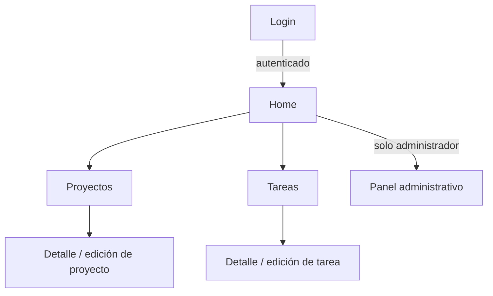

# Trazo

**Planifica. Organiza. Entrega.**

Trazo es una aplicación web de gestión de proyectos y tareas, desarrollada en **Vue 3** como MVP para el curso de Ingeniería de Software para Aplicaciones Web. La persistencia de datos se maneja mediante **LocalStorage** en el navegador, sin necesidad de un backend para esta primera entrega.

Más contexto del proyecto (modelo verbal, diagrama de clases, diagrama de arquitectura, reglas de programación) está documentado en la [Wiki del repositorio](https://github.com/Tomasposada26/Trazo/wiki).

## Tecnologías utilizadas

- [Vue 3](https://vuejs.org/) (Composition API)
- [Vite](https://vite.dev/)
- [Vue Router](https://router.vuejs.org/)
- [Pinia](https://pinia.vuejs.org/)
- [ESLint](https://eslint.org/) + [Prettier](https://prettier.io/)
- [Chart.js](https://www.chartjs.org/)

## Requisitos previos

- [Node.js](https://nodejs.org/) versión 22.18 o superior (o 24.12+)
- npm

## Instalación

```sh
npm install
```

## Ejecución en modo desarrollo

```sh
npm run dev
```

Esto levanta el servidor de desarrollo (por defecto en `http://localhost:5173`). La ruta principal de la aplicación es `/`, que carga la vista **Home**.

## Compilar para producción

```sh
npm run build
```

Los archivos generados quedan en la carpeta `dist/`.

## Previsualizar el build de producción

```sh
npm run preview
```

## Linter y formateo

```sh
npm run lint
npm run format
```

Antes de cada `push` se debe ejecutar `npm run lint` y `npm run format` sin errores (ver [Guía de estilo de programación](https://github.com/Tomasposada26/Trazo/wiki/Gu%C3%ADa-de-estilo-de-programaci%C3%B3n) en la Wiki).

## Estructura del proyecto

```
src/
├── components/   # Componentes reutilizables (tablas, filtros, gráficos, etc.)
├── views/        # Vistas / páginas (Single File Components)
├── router/       # Configuración de rutas
├── stores/       # Estado global (Pinia)
├── services/     # Acceso a datos (LocalStorage)
├── models/       # Clases del dominio (Project, Sprint, User, Task)
├── utils/        # Funciones puras reutilizables (formateo, validaciones, etc.)
├── styles/       # Estilos CSS globales
└── assets/       # Recursos estáticos (imágenes, íconos)
```

Las reglas de organización del código están detalladas en [Reglas de programación](https://github.com/Tomasposada26/Trazo/wiki/Reglas-de-programaci%C3%B3n).

## Módulos principales del sistema

- **Autenticación**: login, gestión de sesión en LocalStorage y protección de rutas.
- **Proyectos**: CRUD de proyectos.
- **Tareas**: CRUD de tareas, asociadas a un proyecto.
- **Panel administrativo**: indicadores, filtros y gráficos (Chart.js) visibles solo para administradores.
- **Componentes reutilizables**: tabla, selector/filtro y gráfico, usados por los módulos anteriores.

## Flujo de navegación entre vistas

Estado actual: solo existen las rutas `Home` y `Login` (base de la issue #2). El siguiente diagrama documenta el flujo objetivo a medida que se implementen las issues #4 a #10.



## Equipo

- Mateo
- Hever
- Tomás Posada (Arquitecto)
