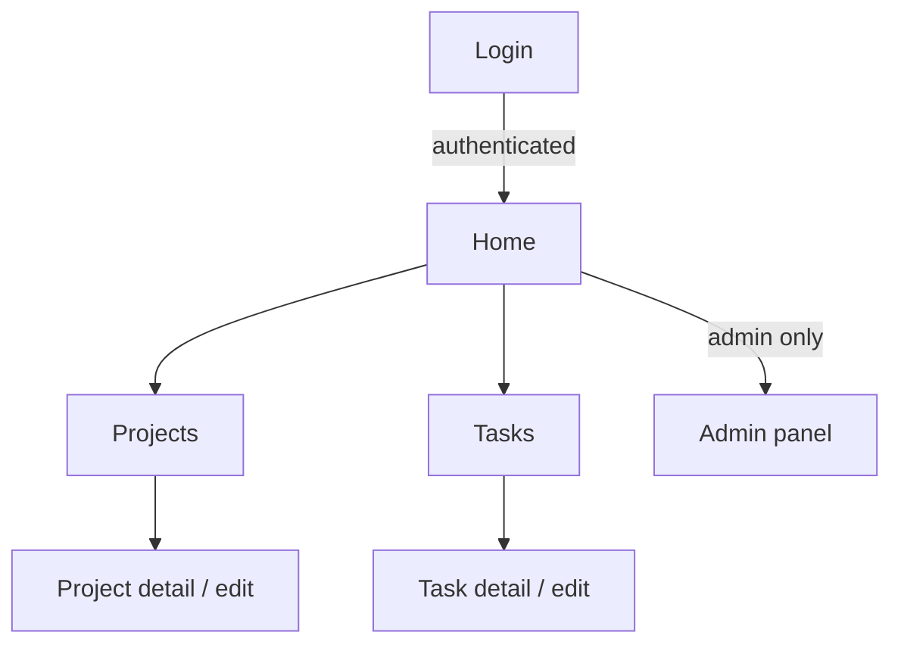

# Trazo

**Plan. Organize. Deliver.**

Trazo is a project and task management web application, built with **Vue 3** as an MVP for the Software Engineering for Web Applications course. Data persistence is handled via **LocalStorage** in the browser, with no backend required for this first delivery.

More project context (verbal model, class diagram, architecture diagram, programming rules) is documented in the [repository Wiki](https://github.com/TomasPosada0626/Trazo/wiki).

## Technologies used

- [Vue 3](https://vuejs.org/) (Composition API)
- [Vite](https://vite.dev/)
- [Vue Router](https://router.vuejs.org/)
- [Pinia](https://pinia.vuejs.org/)
- [ESLint](https://eslint.org/) + [Prettier](https://prettier.io/)
- [Chart.js](https://www.chartjs.org/)

## Prerequisites

- [Node.js](https://nodejs.org/) version 22.18 or higher (or 24.12+)
- npm

## Installation

```sh
npm install
```

## Running in development mode

```sh
npm run dev
```

This starts the development server (by default at `http://localhost:5173`). The application's main route is `/`, which loads the **Home** view.

## Building for production

```sh
npm run build
```

The generated files are placed in the `dist/` folder.

## Previewing the production build

```sh
npm run preview
```

## Linting and formatting

```sh
npm run lint
npm run format
```

Before every `push`, `npm run lint` and `npm run format` must run without errors (see the [Programming Style Guide](https://github.com/TomasPosada0626/Trazo/wiki/Programming-Style-Guide) in the Wiki).

## Project structure

```
src/
├── components/   # Reusable components (tables, filters, charts, etc.)
├── views/        # Views / pages (Single File Components)
├── router/       # Route configuration
├── stores/       # Global state (Pinia)
├── services/     # Data access (LocalStorage)
├── models/       # Domain classes (Project, Sprint, User, Task)
├── utils/        # Reusable pure functions (formatting, validation, etc.)
├── styles/       # Global CSS styles
└── assets/       # Static assets (images, icons)
```

Code organization rules are detailed in [Programming Rules](https://github.com/TomasPosada0626/Trazo/wiki/Programming-Rules).

## Main system modules

- **Authentication**: login, session management in LocalStorage, and route protection.
- **Projects**: project CRUD.
- **Tasks**: task CRUD, associated with a project.
- **Admin panel**: indicators, filters, and charts (Chart.js) visible only to administrators.
- **Reusable components**: table, selector/filter, and chart, used by the modules above.

## Navigation flow between views

Current state: only the `Home` and `Login` routes exist (base of issue #2). The diagram below documents the target flow as issues #4 through #10 are implemented.



## Team

- Mateo
- Hever
- Tomás Posada (Architect)
